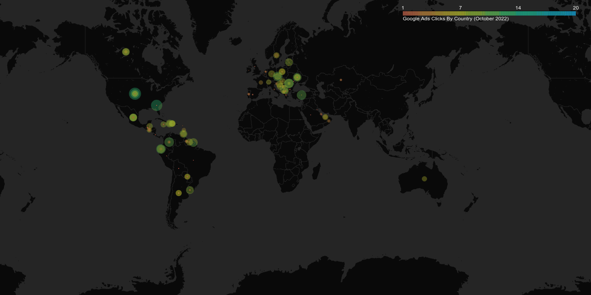

# World Map of Ad Impressions and Clicks

### Quick start
1. Get your API key here: https://onboard.windsor.ai
2. Enter it line 9 of `main.py` file.
3. Run `pip install -r requirements.txt` and then `python main.py`
4. Share your gif on Twitter.


### Introduction
This repository offers two kinds of solutions. First, it provides the functionality to create animated maps in HTML 
format for timeseries datasets. Second, it adds the ability to convert HTML animated maps into animated gif images.

As far as the dataset is concerned, you need to have at least date, location (country), and value columns. Below you can
find a sample dataset retrieved from the [Windsor](https://windsor.ai) website. This dataset is a combination of various ad platforms
such as Google Ads, Facebook ads etc., during October 2022.


| date        | country      | source   | campaign  | clicks |
|-------------|--------------|----------|-----------|--------|
| 2022-10-08  | Afghanistan  | google   | pmax test | 1      |
| 2022-10-08  | Afghanistan  | google   | Sales     | 5      |
| 2022-10-10  | Afghanistan  | google   | pmax test | 11     |
| 2022-10-11  | Afghanistan  | google   | pmax test | 6      |
| 2022-10-11  | Afghanistan  | google   | pmax test | 2      |

Some of the supported ad platforms are:
- Google Ads,
- Facebook Ads,
- Linkedin Ads,
- Snapchat Ads,
- TikTok Ads

For a full list, check the following url: https://windsor.ai/connector/all/. 


### Detailed Description
Running the code is pretty simple. Firstly, install the dependencies in the `requirements.txt` file. You can do that
by running `pip install -r requirements.txt`.

Next, you can either use your own dataset or fetch the data directly into python using [Windsor's](https://windsor.ai) token.
You can do this by running

```python
import pandas as pd
from pywindsorai.client import Client


client = Client(api_key="your-token-key")
request = client.connectors(
    date_from="2022-10-01",
    date_to="2022-11-01",
    fields=["date", "country", "source", "campaign", "clicks"],
    connector="google_ads"
)
dataset = pd.DataFrame(request["data"])
```

If you already have your dataset, you can read it as a csv file too. Then you can generate latitude and longitude by
```python
from map_converter import Map
# Create map
generator = Map()
# If dataset does not have latitude and longitude, find them.
dataset = generator.get_lat_long(dataset, location_column="country")
```

Lastly, create an animated html file and save it as gif.
```python
 # Create HTML map
generator.create_map(
    data=dataset,
    caption="Google Ads Clicks By Country (October 2022)",
    normalize=True
)
# Convert map to gif.
generator.to_gif(driver_option="Chrome", duration=500)
```

### Result
The final products are an HTML file and a gif image.



For more on connecting various ad platforms and plotting them into animated maps, visit: https://onboard.windsor.ai/
